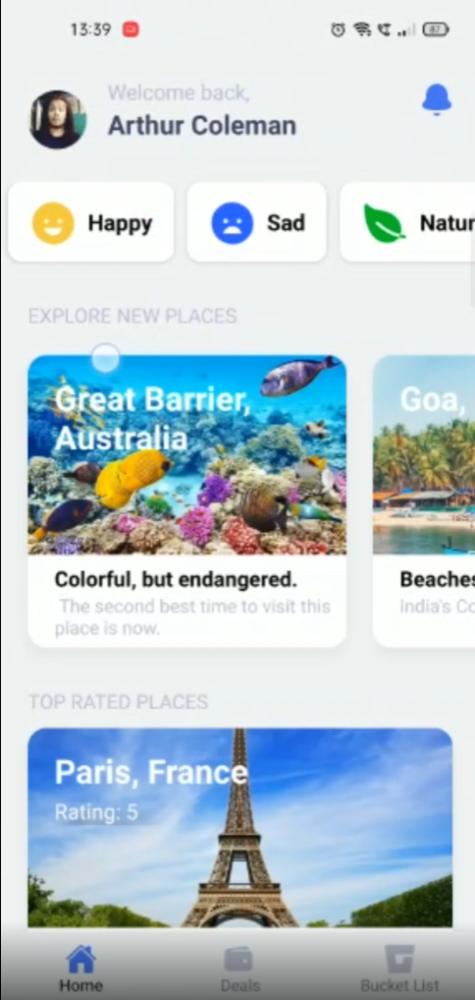
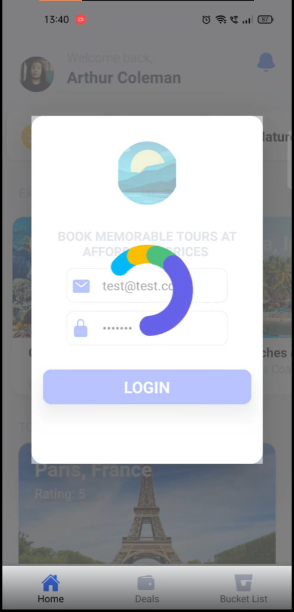

## Serenity-Now - An app to manage memorable vacations and time off work

### This project showcases all I've learnt in React-Native. By using the guidance of a few videos and articles I've read, I built this app, with slick animations and a good UI.

## Screenshots and GIFs

  

### The Introduction to the App's UI, various tours and React Native Components.

[The App's Fresh Look](https://i.imgur.com/pELcX75.mp4)

### Infinite Looping Stackable Cards with Pan Gesture Control with Micro-Interactions.

[Stackable Gesture Controlled Cards](https://i.imgur.com/qK7YTyo.mp4)

### User Authentication Flow with Firebase and Lottie Animations.

[Lottie Animations and Authentication](https://i.imgur.com/jseZqmj.mp4)

## Technologies used

- [React Native (Expo)](https://expo.dev/) - The base framework for building the app, using the Expo CLI and Metro Bundler.
- [Redux Toolkit](https://redux-toolkit.js.org/) - A library for managing state in React Native throughout the application, which is much easier to use than the built-in React Native state management and Native Redux.
- [GraphQL using the Apollo Client](https://www.apollographql.com/) - A GraphQL client for React Native, which is used to fetch data from the Contentful CMS.
- [React Navigation](https://reactnavigation.org/) - To manage the various screens and tabs in the app.
- [Contentful CMS](https://www.contentful.com/) - Content Management System - To store and manage the data for the app.
- [Async Storage](https://reactnative.dev/docs/asyncstorage) - For persisting data across sessions.
- [Firebase for Authentication](https://firebase.google.com/) - To authenticate the user
- [Lottie Animations](https://lottiefiles.com/) using the [AirBnb React Native Lottie library](https://airbnb.design/lottie/) - To create the slick and fun animations for the app.
- [Styled Components](https://styled-components.com/) - To style React Native components, using SCSS.
- [Random User API](https://randomuser.me/) - To generate random users for the app.

## Features

- React Native Animations and Transitions using the Animated library and Lottie Animations.
- React Native Modals
- Stackable and Pannable cards, using the PanResponder and Animated libraries.
- Gesture Control for the cards, using the PanResponder and Animated libraries.
- Beautiful UI and Animations
- Persistent Data Storage and Retreival
- Authentication using Firebase
- SVG Icon Components
- Complex State Management using Redux Toolkit
- Dynamic Data using GraphQL and Contentful CMS
- Multiple Screens and Tabs

## How to run

1. Either download the APK available in the repo and run it on Android devices. IOS devices are not fully supported yet.
2. Second way, is to run the app on your computer using the Expo CLI. You can find the instructions [here](https://docs.expo.io/versions/latest/guides/using-expo-cli.html).
   - Install Expo CLI
   - Clone the repo
   - Run `npm install` to install the dependencies.
   - Run `npm start` to start the app.
